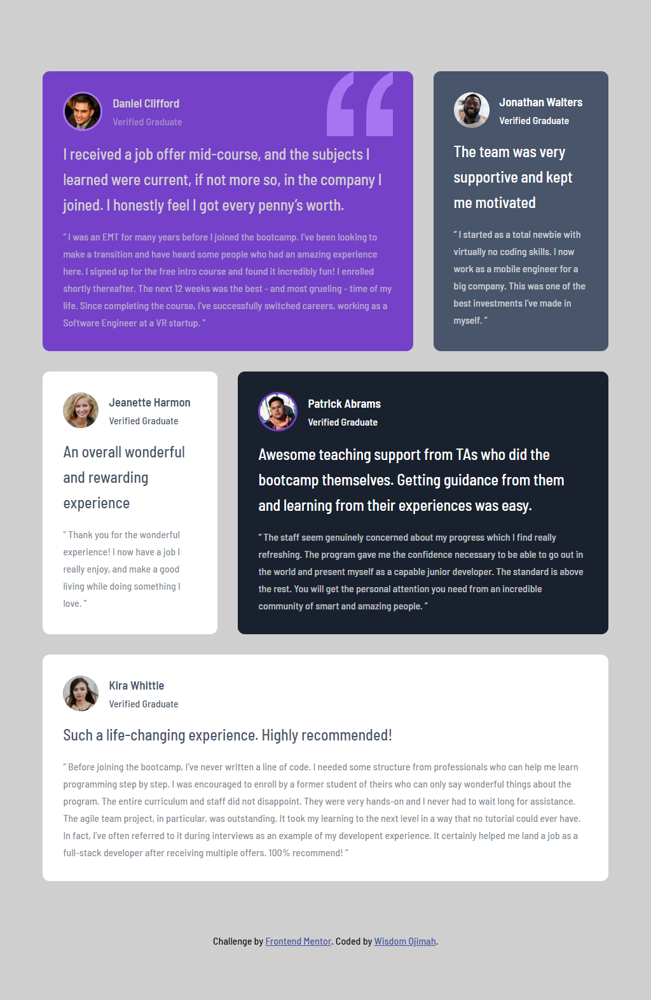
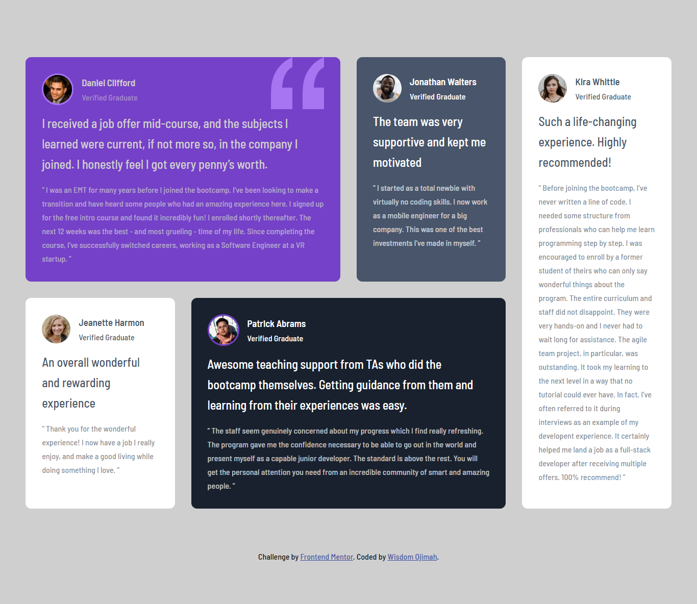

# Frontend Mentor - Testimonials grid section solution

This is a solution to the [Testimonials grid section challenge on Frontend Mentor](https://www.frontendmentor.io/challenges/testimonials-grid-section-Nnw6J7Un7). Frontend Mentor challenges help you improve your coding skills by building realistic projects.

- The live demo can be viewed here [Live Preview](https://detachedsoul.github.io/testimonials-grid-section/)

## Table of contents

- [Overview](#overview)
  - [The challenge](#the-challenge)
  - [Screenshot](#screenshot)
  - [Links](#links)
- [My process](#my-process)
  - [Built with](#built-with)
- [Author](#author)

## Overview

### The challenge

Users should be able to:

- View the optimal layout for the site depending on their device's screen size

### Screenshot

### Links

- Solution URL:   [Link to solution](https://github.com/detachedsoul/testimonials-grid-section)
- Live Site URL:  [Live View](https://detachedsoul.github.io/testimonials-grid-section)

## My process

### Built with

- Semantic HTML5 markup
- CSS custom properties
- Flexbox
- CSS Grid
- Mobile-first workflow

## Author

- Website - [Wisdom Ojimah](https://github.com/detachedsoul)
- Website - [Wisdom Ojimah](https://wisdomojimah.000webhostapp.com)
- Frontend Mentor - [detachedsoul](https://www.frontendmentor.io/profile/detachedsoul)